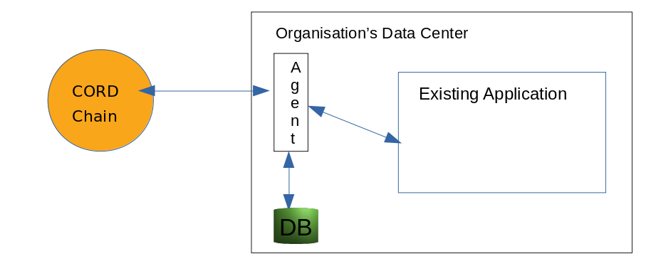

# CORD Agent

This project provides REST APIs to [cord.js](https://github.com/dhiway/cord.js) SDK, which can be used for creating and verifying 'Verifiable Credentials (VC)'. We can call it an agent as this can be hosted on one of the local network machine, and can work on once's behalf while interacting with the chain.

This same project is hosted on https://agent.demo.dhiway.com and swagger api documents are hosted at https://agent.demo.dhiway.com/docs. You can use the ./apis.json file for postman collection too.

## Docs

Check API documentation by checking http://localhost:5001/docs while project is running.

Or if you want a local html page then run `npx open-swagger-ui ./apis.json --open` from console.

Below diagram would give an idea of how to deploy the project, and its intended use.

Note that, this project is just a demostration of how to interact with the CORD Network. This includes the SDK as part of it.

As shown, the project is intented to be deployed in a 'secure network', with the application, so there is no sample of authentication used in the project. We recommend deploying it closer to the client application.

Note that on the CORD Network, we will only have transaction of extrinsic calls (ie, the methods) with the argument, and the Events like identifier creation. The data would reside with the agent hosted on client network. The DB used by Agent should be used with enough backup etc, so the high availability is managed.

For example, the #MARK Studio (https://studio.dhiway.com) is one of the extended version of this agent, which has evolved to provide more APIs and is hosted as multi-user SaaS project. To achieve it, studio project has implemented authentication logic, and many other integrations. This Agent project is a base to extend CORD interaction with any other application.

